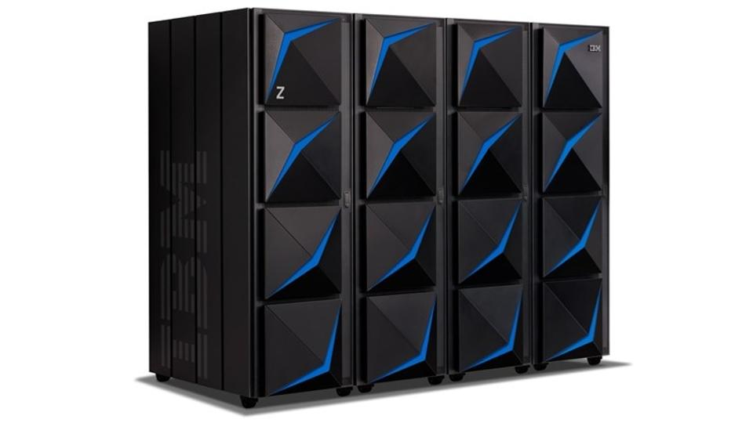

# Procedural Languages

You are probably the most familiar and comfortable with procedural languages.
The idea of _procedures_ is straightforward -- a **procedure** is a set of computational steps.
You know these, or at least can think of these, as functions.
The idea of a _procedural language_ is hence to write code as a list of computational steps, some of which can call procedures that execute other sets of computational steps.

## Imperative Languages?

So here's the situation -- the set of imperative languages is a superset of the set of procedural languages.
What is an imperative language, then?
I'm glad you asked -- an _imperative language_ uses statements, lines of code, to change the program's state.
You can somewhat think of procedural languages as an implementation of imperative languages, but object-oriented languages are also imperative.
The best way to see this is through actual programming languages.
Consider C and Assembly.
C uses functions and statements, and Assembly is a simple list of basic register commands.
Recall that C _compiles_ down to Assembly.
Well, C is a procedural language, and Assembly is an imperative language.
The difference is that Assembly has no _native_ concept of functions (other than labels and address jumps), but C functions certainly can be compiled down to straight Assembly code.

Another (tangentially related) example -- Java compiles down to Bytecode.
In this analogy, Bytecode is akin to Assembly whereas C is akin to Java.
One thing to note -- Java is object-oriented -- another form of imperative -- which is really an extension of procedural.

A common theme arises that strictly imperative languages are mostly (if not all) machine-readable (built for hardware execution).
This is due to the nature of the programming languages chain, that higher-level languages compile down to lower-level languages.
Hardware "reads" the lowest language possible -- machine code (bit-strings).
Machine code is too complicated to remember, so expert coders created Assembly to act as an abstraction for machine code.
Then these experts created higher-level languages to act as abstractions for Assembly, because Assembly was also too hard to remember.
You get the point.
Since machine code is essentially random bit-strings, we don't really assign it to a programming paradigm.
But Assembly (and other languages) acts as an abstraction, so it inherently has a structure that we can classify.

## Structure and Control Flow

Structure relates to control flow.
What is control flow?
It's how your language flows through execution.
For example, some JavaScript code:
```javascript
function foo(arg1, arg2) {
    console.log(arg1, arg2);
}

if (true) {
    foo("Hello", "World");
} else {
    foo("World", "Hello");
}
```
This code goes line-by-line, first creating the `foo` function, then running the `if-else` statement, which enters the first code block and runs that first `foo(...)` function, which then prints to the console.

A similar example, but in C:
```C
#include <stdio.h>
#include <string.h>

int main () {
    char arg1[5] = "Hello";
    char arg2[5] = "World";
    char tmp[5];
    goto IFSTMT;

    FOO:
    printf("%s %s", arg1, arg2);
    goto END;

    IFSTMT:
    if (1) {
        goto FOO;
    } else {
        strcpy(tmp, arg2);
        strcpy(arg2, arg1);
        strcpy(arg1, tmp);
        goto FOO;
    }

    END:
    return 0;
}
```
**Do not write C code like this.**
This is _bad_ C.
C has functions, this code is to illustrate a point.

This code, like the first, executes line-by-line, but the _control flow_ jumps around quite a bit.
We start our journey creaating three strings, then we jump down 4 lines, runs the first block of the `if-else` statement, jumps _back up_ 4 lines, prints to `stdout`, and jumps to the end of `main`.
That's a lotta damage.
Well, that's a lot of jumping around.

Both code samples accomplish the same thing, but the first uses a **structured** paradigm while the second uses an **unstructured** paradigm.
The _unstructured_ paradigm utilizes jumps to labels or instruction addresses in the code, whereas the _structured_ paradigm utilizes control flow statements like `if-then-else`, `do-while`, `for`, `try-catch-finally`, and functions.
Edsger W. Dijkstra once said:
> The **go to** statement as it stands is just too primitive; it is too much an invitation to make a mess of one's program. ... \[Your code\] should satisfy the requirement that a programmer independent coordinate system can be maintained to describe the process in a helpful and manageable way.
<https://dl.acm.org/doi/10.1145/362929.362947>.
Dijkstra is saying here that unstructured programming leads to hard-to-follow code.
While that's true (see how it's more difficult to follow the execution flow of the C code), unstructured programming can indeed still be useful!

## ???

We know, we know.
That was a lot to take in.
Before we move on, let's try to organize this as best as we can.
* Imperative uses statements to change program state
* Procedural uses subroutines, like functions, along with statements
* Structured means control-flow blocks, Unstructured means instruction address jumps, and programming languages can have elements of both
```txt
structured v. unstructured

imperative
`- procedural
 - object-oriented
```

## Procedural Language Examples

The following languages are procedural:
* Fortran
* COBOL
* BASIC
* Pascal
* C

## COBOL

Now begins our forray into learing basic COBOL.

### Introduction

COBOL stands for **CO**mmon **B**usiness-**O**riented **L**anguage.
The name is fitting, since COBOL is almost exclusively used for computational tasks involed in business, finance, and administration -- which, honestly, could mean anything.
But, seriously, COBOL is used _everywhere_.
Health care? You betcha.
College services (Testudo)? Heck yeah.
Banks? Probably the most common utilizer.
Investment firms? Yes.

Why is COBOL so common?
Businesses and data-intensive services require specialized computers to process bulk data.
The IBM Mainframe is one such computer, and it commonly runs COBOL (or FORTRAN):



For an online COBOL tutorial, head on over to [Tutorials Point](https://www.tutorialspoint.com/cobol/index.htm).

### The Problem With Old Languages

Standardization was not a concern back in the good 'ol days.
Well, it was, but not really.
It's weird.
For COBOL, the language designers did not focus on making past versions compatible with newer versions.
We'll do our best.
The principles of the language carry between each version, so it's not a huge concern.
After this class, you should be good enough to pick up a language efficiently that language versions don't concern you.

### Environment

So how are we going to execute our COBOL code?
Our Docker image contains GnuCOBOL ([manual](https://open-cobol.sourceforge.io/doc/gnucobol.pdf)), which is a C compiler for COBOL.
There also exist Mainframe emulators, but those require learning a JCL (Job Control Language -- basically a scripting language to start jobs on a Mainframe).
For this class, we care more that you learn the basics of procedures.

Note also that COBOL used to be written on _punch cards_ ([read more here](http://www.columbia.edu/cu/computinghistory/fisk.pdf)).
Punch cards used to be punched-out 80-character cards that represented one program statement per card:


The punch card system was essentially an ASCII look-up translation system for computers, which could easily recognize punched-out holes (optical character recognition (OCR) did not really exist yet).
Anyway, the upshot of this is that COBOL can be written in **fixed** format, which requires each typed statement fit in a specific 80-character row, or in **free** format, which has no such restrictions.
We will be using **free** format, for sanity.
[See here](https://supportline.microfocus.com/documentation/books/nx60/lhintr.htm) for more information about the differences.

The upshot of all of this is that if you ever plan on _using_ COBOL in industry, you will need to learn certain specifics of Mainframe programming and probably some slight source code modifications (like indentation, format specifiers, etc).
Hopefully, though, you
* will never have to use COBOL
* will have learned enough from this class that you can learn a language blind (and adjust on-the-fly)

### Hello

Let us first look at a classic _Hello World_ program:
```COBOL
*> filename: hello.cob
IDENTIFICATION DIVISION.
PROGRAM-ID. HELLOWORLD.
PROCEDURE DIVISION.
DISPLAY 'Hello, World!'.
STOP RUN.
```
We run this as follows:
```Shell
cobc -x -free hello.cob -o hi
./hi
```
Which outputs, as expected:
```Text
Hello, World!
```

Alright, so we learn a few things from this simple example.
First, we see that COBOL is _compiled_ using `cobc` (from GnuCOBOL).
Second, we see that `-free` tells `cobc` that we are using the modern style for COBOL (where we can ignore some of COBOL's unnecessary formatting constraints).
Third, we see a rough structure for setting up programs.

COBOL programs are separated into _divisions_.
There are four divisions, each with a different purpose.
* The _identification_ division, which is the only mandatory division, gives information about the program itself
* The _environment_ division gives information about the computer and necessary I/O (like files)
* The _data_ division contains variables (and related things)
* The _procedure_ division contains actual execution statements and procedures
We will be most focused on the procedure division, since that contains the _procedures_ -- the main topic for this lecture.

We note here that most COBOL programmers just copy-paste a template program setup, so there's no need to concern yourself with memorizing COBOL program division structure.
The more interesting ideas happen in the procedure division (and the data division, because variables).

COBOL also names things as English grammar.
COBOL has "sentences" and "verbs" (for example).
All of it is intuitive -- sentences contain things to do, verbs do the things, etc.
The verbiage COBOL uses can drag you down, so don't worry about it too much.

### LEG (c)

For COBOL, we'll use Justin's Learning Efficiency Guide (with modifications -- it isn't perfect).

#### Documentation

Lots of it exist!
* <https://www.tutorialspoint.com/cobol/index.htm>
* <https://www.mainframestechhelp.com/tutorials/cobol/>
* <https://www.ibm.com/support/knowledgecenter/SS6SG3_4.2.0/kc_gen/entcobolxml-gen13.html>
* <http://www.cs.gordon.edu/courses/cs323/COBOL/cobol.html>
* <https://riptutorial.com/cobol>
This list seems short, but these websites are resource-dense.

Googling `cobol <keyword>` typically brings up a help article explaining what it does and how it's used.
You will also find that Googling `how to do <x> cobol` brings up plenty of useful information.

Refer to finding information online **often**.
COBOL has over 300 keywords, some having multiple forms/syntax.
You should not have to memorize these when starting out -- the important ones will become innate, however.

#### Structure

We have already seen simple IO -- `DISPLAY 'stuff to be displayed' var 'more stuff'`.
For user input, we use `ACCEPT VAR` which puts the next line of input into the variable `VAR`.
For system-level input (eg: command line args, system date, etc) we use `ACCEPT VAR FROM ...`.

We have also seen COBOL file structure.
COBOL programmers copy-paste a template file instead of memorizing the structure.

#### Arithmetic/Data

Okay, now we're getting to the good stuff.
COBOL "data" is easier to talk about, so we do that first.
Variables are all globally scoped.
This means that **all variables have to be defined in the** `WORKING-STORAGE SECTION` inside the `DATA DIVISION`, and they are visible to the entire program in the `PROCEDURE DIVISION`.

Data can be structured using "level numbers" -- this is the COBOL way to have data closer in nature to "objects" or "records".

Simple variables are declared like so:
```COBOL
01 VAR-NAME PIC X(14) VALUE 'hunter2'.
```
* `01` says it's a top-level variable
* `VAR-NAME` is the variable name
* `PIC` allows you to specify the variable type
* `X(14)` is the actual variable type
* (optional) `VALUE` says that whatever follows is put into the variable by default

For our data types, we have:
```txt
9 -> numeric
A -> alphabetic
X -> alphanumeric
V, S, P -> special decimal/sign/precision types
```
These are followed by a length (bytes, in parenthesis) used by the variable.
For numbers, a digit constitutes one byte.
For alphabetic, a character constitutes one byte.
You may also see variables written with multiple of the data-type characters.
We won't focus on the advanced types involving signs and floats.

Level Numbers:
```txt
01    -- record/group desc entry
02-49 -- group/elementary items
66    -- rename clause items
77    -- items without sub-division
88    -- condition name entry
```
Our forray into COBOL is simple enough that we can restrict our view to level numbers `01-49`.
We specify level numbers to apply structure to data.
The current variable descriptor can have any number of sub-levels, so long as its sub-levels have level numbers lower than its own.

Variable names do not have to be capitalized.
Variable names cannot be keywords, must contain an alphabet character, and cannot have a `+`.

Example:
```COBOL
*> cobc -x -free variables.cob
IDENTIFICATION DIVISION.
PROGRAM-ID. VARIABLES.
DATA DIVISION.
    WORKING-STORAGE SECTION.
    01 VAR-STR PIC X(8) VALUE '1234abcd'.
    01 VAR-YEET.
        02 YEET-A PIC 9(2).
        02 YEET-X.
            05 YEET-X-A PIC A(8) VALUE 'sub'.
            05 YEET-X-B PIC A(8) VALUE 'part'.
        02 YEET-B PIC X(4) VALUE '$2ab'.
PROCEDURE DIVISION.
    DISPLAY VAR-STR
    DISPLAY VAR-YEET
    DISPLAY YEET-A YEET-X YEET-B
    DISPLAY YEET-X-A ' - ' YEET-X-B
    STOP RUN.
```
produces
```txt
1234abcd
00sub     part    $2ab
00sub     part    $2ab
sub      - part    
```
Notice there are spaces and zeros where data are uninitialized.

Simple arithmetic:
```COBOL
ADD a TO b        *> b = b + a
SUBTRACT a FROM b *> b = b - a
MULTIPLY a BY b   *> b = b * a
DIVIDE a INTO b   *> b = b / a (integer division)
```

There are multiple forms of the basic keywords above.
You can do most math using these forms, but some advanced forms might make things easier.
[Advanced arithmetic](https://www.tutorialspoint.com/cobol/cobol_basic_verbs.htm):
```COBOL
ADD a b TO c d                      *> c=a+b+c, d=a+b+d
ADD a b c TO d GIVING e             *> e=a+b+c+d
ADD CORR group1 TO group2           *> group2 = group1 + group2 ("component-wise array addition")

SUBTRACT a b FROM c d               *> c=c-(a+b), d=d-(a+b)
SUBTRACT a b c FROM d GIVING e      *> e=d-(a+b+c)
SUBTRACT CORR group1 TO group2      *> g2 = g2 - g1 (component-wise)

MULTIPLY a BY b c                   *> b=a*b, c=a*c
MULTIPLY a BY b GIVING e            *> e=a*b

DIVIDE a INTO b                     *> b=b/a
DIVIDE a BY b GIVING c REMAINDER r  *> c=a/b, r=a%b
```
Don't sweat memorizing these -- look them up when you need to.

Normal arithmetic:
```COBOL
COMPUTE VAR = [math expr using +,-,*,/]
```

Moving data is fundamental to computing.
It is natural that COBOL has a `MOVE` keyword.
Note that COBOL `MOVE var1 TO var2` actually _copies_ `var1` into `var2`.
Be careful with variable byte lengths here.
Finally, moving can be done between the three data types **except** for `A <-> 9` (alphabetic to and from numeric).

Related to moving -- splicing.
If you want to pull out a substring, you can splice it using `VAR(x:l)` -- this takes the next `l` values inside of `VAR` starting at `x`.
You can use numeric variables or actual numbers for splicing.
Note that splicing is 1-based, not 0-based.

We end this section with tables (arrays).
Note that there are no variable-length tables in COBOL.
You _can_ use C functions, and call `malloc`, but that's too advanced for us.
Use the `OCCURS` keyword to specify a variable as a table.
This simply repeats the variable and allows indexing.
Nest using level numbers.
Index a table using subscript notation: `VAR(d1, d2, ...)`.
Indexing has to happpen on the variable containing the `OCCURS` keyword.
Note that indexing is 1-based, not 0-based.

```COBOL
...
    WORKING-STORAGE SECTION.
        01 some-data PIC 9(6).
        01 othr-data PIC X(6).
        *> 1D table
        01 table1.
            03 table1-row PIC 9(2) OCCURS 3 TIMES.
        *> 2D table
        01 table2.
            02 table2-row OCCURS 4 TIMES.
                04 row2-data-opt PIC A(1) VALUE 'e'.
                04 table2-col PIC 9(2) OCCURS 5 TIMES.
        *> ...
...
PROCEDURE DIVISION
    DISPLAY '| ' some-data ' | ' othr-data ' |'.
    MOVE  12  TO some-data.
    MOVE 'A1' TO othr-data.
    DISPLAY '| ' some-data ' | ' othr-data ' |'.
    DISPLAY some-data(5:2).
    DISPLAY othr-data(1:2).
    MOVE 'B2' TO othr-data(4:1).
    DISPLAY '| ' some-data ' | ' othr-data ' |'.

    DISPLAY table1.
    DISPLAY table2.
    DISPLAY table1-row(3).
    DISPLAY table2-row(3).
    DISPLAY table2-col(3,4).

    MOVE 11 TO table1-row(3).
    MOVE 19 TO table2-col(3,4).

    DISPLAY table1.
    DISPLAY table2.
    DISPLAY table1-row(3).
    DISPLAY table2-row(3).
    DISPLAY table2-col(3,4).

    STOP RUN.
```
produces
```txt
| 000000 |        |
| 000012 | A1     |
12
A1
000000
e0000000000e0000000000e0000000000e0000000000
00
e0000000000
00
000011
e0000000000e0000000000e0000001100e0000000000
11
e0000001100
11
```

#### Control Flow

The last part -- we cover, procedures (functions), conditionals, and looping.

Procedures work like functions.
You precede a set of code lines with a procedure label (like a function name) and a period.
That tells the compiler that the next set of lines should be executed when the label is `PERFORM`ed.
The compiler knows your paragraph ends when it encounters another label.
Procedures are sets of "sentences" which form "paragraphs", so you can use the keyword `EXIT PARAGRAPH` to break out of a procedure early.
Similarly, you can `STOP RUN` to break out of the entire `PROCEDURE DIVISION` and exit execution.
```COBOL
...
    WORKING-STORAGE SECTION.
        01 alpha PIC 9(4).
        01 beta  PIC 9(4).
        01 gamma PIC 9(4).
...
PROCEDURE DIVISION
    PERFORM func1.
    PERFORM
        DISPLAY "in-line perform"
        DISPLAY "another continuation line"
    END-PERFORM.
    PERFORM func-c THRU func-b.

    func1.
    DISPLAY "Hello, World!".

    small-disp.
    DISPLAY alpha " " beta " " gamma.
    EXIT PARAGRAPH.

    func-c.
    MOVE 5 TO alpha.
    MOVE 3 TO beta.
    PERFORM small-disp.

    func-a.
    MOVE 2 TO gamma.
    PERFORM small-disp.

    func-b.
    MULTIPLY alpha BY beta GIVING gamma.
    PERFORM small-disp.
    STOP RUN.

    never-called.
    DISPLAY "this is not called".
```
outputs
```txt
Hello, World!
0005 0003 0000
0005 0003 0002
0005 0003 0015
```
Remember, variables are global so procedures need not take in arguments.

Execution is line-by-line.
In the previous example, if we put the first 6 lines in the `PROCEDURE DIVISION` at the end of all our code then we would get the following output:
```txt
Hello, World!
0000 0000 0000
0005 0003 0000
0005 0003 0002
0005 0003 0015
```
This is because, regardless of paragraph lablels, COBOL executes line-by-line.
In this case, the first line is `func1`, followed by `small-disp`, followed by `func-c` and `func-a`, and terminated by `func-b`.
In this special example, try for yourself moving the `STOP RUN.` to the very end.

Now that we understand procedures and control-flow, we can finish up with conditionals and looping.

```COBOL
*> conditional
IF ... THEN
    ...
END-IF.

IF ... THEN
    ...
ELSE
    ...
END-IF.

*> switch
EVALUATE ...
    WHEN ...
        ...
    WHEN ...
        CONTINUE
    ...
    WHEN OTHER
        ...
END-EVALUATE.
```

Some comparison operators you might find useful:
```txt
<>   (not equals)
=    (equals)
<, <=, >=, >    (as expected)

OR, AND, NOT    (as expected)
```

Looping is implemented using the `PERFORM` keyword (just as we did in-line procedures).
There are multiple variations:
```COBOL
*> proc == procedure label
*> condition == some boolean condition

*> loops until condition is True (default tests condition before procedure)
PERFORM proc UNTIL condition.
*> loops until condition is True, tests before procedure is run
PERFORM proc WITH TEST BEFORE UNTIL condition.
*> loops until condition is True, tests after procedure is run
PERFORM proc WITH TEST AFTER UNTIL condition.
*> loops n times
PERFORM proc n TIMES.
*> loops until condition is met, but has auto-increment
*> this needs  var  to exist in working-storage
*> typically the condition will rely on  var
PERFORM proc VARYING var FROM start BY increment UNTIL condition.
```

### Code Examples

We have examples in this repo, and [this website](http://www.csis.ul.ie/cobol/examples/default.htm) contains more.
