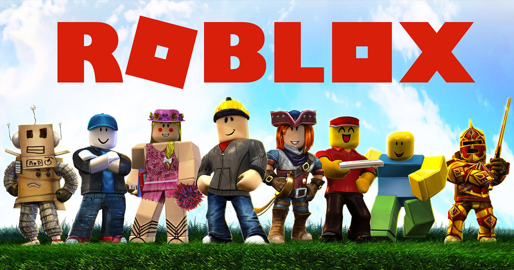

# Scripting Languages

You will likely pick up a scripting language as you traverse your computer science career.
Scripting languages are typically easy to learn and fast for coding up solutions.
Unfortunately, scripting languages are characterized as _slow_.
In this lecture, we will uncover the pros and cons of scripting languages, why they are so, and what situations you might use use them.

## PL Implementation

Programming languages have to be implemented somehow.
There needs to be some sort of program that can recognize a specific language and do the actual computations ([this raises the _what came first_ question](https://en.wikipedia.org/wiki/History_of_compiler_construction) -- re: the importance of Grace Hopper).
No high-level programming language can be directly run on a CPU, so there needs to be some sort of _bridge_ between a programming language and the CPU.
In this sense, there are two kinds of "bridges" (programs to understand programming languages) -- interpreters and compilers.

**Interpreters** take in code written in programming language _A_ and execute _meaningful_ code in some other programming language _B_.
**Compilers** take in code written in programming language _A_ and _output_ code in some other programming language _B_.
We say that programming languages that use an interpreter are **interpreted** languages, and likewise languages that use a compiler are **compiled** languages.

Okay, great -- who cares.
Ah yes, weary traveller, good point.
This idea is important because _most_ scripting languages are interpreted, **not** compiled.
But why is _that_ important?
Another great question from our weary traveller.

At _runtime_ (the time point at which you want to _execute_ your code), _compiled_ code is much much faster than _interpreted_ code.
A compiler has to parse code (and potentially do optimizations) _once_ (when you run the compiler), **but** an interpreter has to parse and execute code _every time_ the user wants to run their program.
On the other hand, compilers will likely take longer to finish compiling larger programs, whereas interpreters are much faster.
This is because interpreters parse and execute code one line at a time (more on this later), but compilers have to load, parse, and translate the entire codebase at once.

Now, you may be asking yourself, _well in both cases there's still some sort of language translation, right?_
You are absolutely correct.
Because of this, there is no major theoretical difference between a compiler and an interpreter.
An interpreter translates code and executes it, whereas a compiler translates code and saves it for later execution.
If you can interpret a language, you can almost always compile it (and vice versa).

For what it's worth, though, _compilers_ usually perform _optimizations_, whereas _interpreters_ (usually) just directly parse and execute.

Cool? Cool.
Let's go back to scripting languages (which are typically interpreted).

## REPL

At the heart of interpreters (and by extension scripting) is the REPL -- the **R**ead-**E**val-**P**rint **L**oop.
A _REPL_ is a special program that takes specific user input and produces associated output.
* Read -- read in user input
* Eval -- evaluate the user input
   * verify that the given input represents the language
   * execute the user input as it would in the language
* Print -- print the calculated output
* Loop -- do it all again

For example, Python is an interpreted language.
As per most interpreted languages, we can bring up the REPL by calling `python` (or `python3`) (host computer dependent).
We can also spawn a Docker container to do the same thing.
```txt
$ docker run -it python
Python 3.8.5 (...version details...)
[GCC 8.3.0] on linux
Type "help", "copyright", "credits" or "license" for more information.
>>> 
```

If you have taken CMSC330, or are taking it right now, then you should be familiar with Ruby's REPL `irb`.
You may also be familiar with OCaml's REPL `ocaml` (or `utop`).

Most REPLs will give you a prompt.
* Python gives you `>>>`
* Lua gives you `>`
* Ruby gives you `irb(main):001:0>`
* Node.js gives you `>`
* Bash is a REPL, but you can customize the prompt (typically `$` means bash)
You get the idea.

At the given prompt, you can input language-specific code to have it evaluated.
In the evaluation step, user-input will be checked for language syntax.

Here's an example Lua shell session:
```txt
$ lua
Lua 5.3.5  Copyright (C) 1994-2018 Lua.org, PUC-Rio
> print("hello!")
hello!
> print("unclosed string)
>> "
stdin:1: unfinished string near '"unclosed string)'
> print("unclosed parenthesis"
>>
>> )
unclosed parenthesis
> test
nil
> dank
nil
> 
> a+b
stdin:1: attempt to perform arithmetic on a nil value (global 'a')
stack traceback:
        stdin:1: in main chunk
        [C]: in ?
> a=2
> b=3
> a+b
5
> os.exit() -- or ctrl+D
```
We will understand what's happening here later on.

Note that REPLs will take files as input as well!
Scripting languages can have code written in files called "scripts" which can be executed by the interpreter.
This looks like:
```txt
hello.lua (file contents)
---------
print("Hi!")
---------


$ lua hello.lua
Hi!
$ 
```
On a basic level, an interpreter (basically the REPL) will read in all lines and execute them one-by-one.
Some interpreters will actually make a "first pass" through the inputted code (for function labels, variables, etc) and then make a second execution pass.

## Type Systems

There are two (basic) types of _Type Systems_ -- static and dynamic.
When we say _Type_, we're referencing the type of a variable in a language.
For example, a variable might be an integer.
Said variable has the integer _type_.
Similarly, a string variable has the string _type_ and a float has the float _type_.

Naturally, Type Systems are just a way to categorize a programming language's variable implementation.
**Static Type Systems** require variables to declare their types upon instantiation, and the variable must maintain the same type until death.
**Dynamic Type Systems** have no such requirement -- instead, types are inferred and mutable.

Recall C:
```C
#include <stdio.h>
#include <string.h>

int main () {
    char arg1[5] = "Hello";
    char arg2[5] = "World";

    printf("%s %s", arg1, arg2);

    return 0;
}
```
Our two variables here `arg1` and `arg2` are of type `char*` -- they're strings.
If we were to equate `arg1` to, say, the value `5` (an integer), `gcc` would throw us an error.
On the other hand, recall JavaScript:
```javascript
let a = "Hello";
let b = "World";
console.log(a, b);
a = 5;
console.log(a, b);
```
This throws no such error, because JavaScript is dynamically typed.
We can alter the type of any variable at any point in time.

Most scripting languages are dynamically typed -- this is to aid in the "speed" factor of scripting.
Programmers write scripts because they need to automate something -- no one wants to spend more time writing a script than they would doing the automate-able task.
Types add another level of complexity to the language that's unnecessary for general-purpose scripting.

There are pros/cons to each type system -- that's beyond the scope of this class though :)

## Examples of Scripting Languages

Some scripting languages:
* Shell (Bash)
* JavaScript / Node.js
* Visual Basic for Applications (VBA)
* **Lua**
* Perl
* PHP
* Python
* Ruby

## Final Thoughts

Later on when we discuss meta languages, we will go over domain-specific languages.
The general gist is that domain-specific languages are smaller/constrained programming languages that only apply to specific computing problems.
These include languages like SQL, HTML, CSS, and others.
Some scripting languages can be thought of as domain-specific, and others are quite general-purpose.
In reality, the spectrum of domain-specific to general-purpose is somewhat arbitrary.
This is mostly just an interesting thought that we'll build on later.

One final thought -- most scripting languages have imperative/procedural features.
They are typically executed line-by-line, and they have control-flow operators like `if-else`, looping, and functions.

Oh, you'll also find that scripting languages are easier to pick up but can be harder to debug.
:)

## Lua

Let us now learn Lua.
If you know Python or Ruby, you'll be able to pick up Lua very fast.
You may also find [this website](https://hyperpolyglot.org/) very useful.

### Intro

Lua needs less intro/background than COBOL since Lua is a relatively modern scripting language.
It's easy to learn, easy to work with, and very lightweight.
It's also interpreted, so executing code is a one-step process (compared to COBOL, which requires compiling and _then_ executing).

[Webpage](https://www.lua.org/)

The game [Roblox](https://www.roblox.com) uses Lua for scripts in player-made games.



In-fact, Lua is mostly used for scripting other host applications (like Photoshop and video games).
Though it _can_ be more general-purpose, like Python.
Lua is built on C, like Python.

### Hello

We can print stuff using the `print()` function.
Thus, printing "Hello, World!" is super easy:
```lua
print("Hello, World!")
```

That's it.

We'll also note here that Lua code _can_ be compiled using `luac` -- we won't focus on that though.

### LEG (c)

Justin's Learning Efficiency Guide to the rescue.

#### Documentation

* <https://www.lua.org/pil/contents.html> (read through this)
* <https://www.lua.org/manual/5.3/>
* <https://www.tutorialspoint.com/lua/index.htm>
* <https://devhints.io/lua>

Our previous language, COBOL, had no form of libraries.
Lua, on-the-other-hand, has modules (called "rocks").
[LuaRocks](https://luarocks.org/modules) is the Lua package manager for modules/rocks.

Lua is very modern, so Googling "how to do X" yields valuable results.

#### Structure

There's no structure inside individual Lua files.
Importing modules/files usually occurs at the top of a Lua script, though.
There are two functions to import outside code: `dofile()` and `require()`.
The first assumes the file is in the current directory, while the second also looks through your Lua path.
Oh, Lua also calls execution blocks "chunks" -- a chunk is a single line (in the Lua shell) or an entire file.

Semicolons end statements, but are not necessary to include.
Most Lua programmers will use whitespace (`\n`) to indicate the end of a statement.

Lua has two types of scope -- global and local.
Any variable that does not have `local` in front of its instantiation is a global variable.
Globals can be accessed anywhere.
Local variables only exist in the scope they were established in, though.
We'll talk more about this further down.

#### Arithmetic/Data

Variables are created using the equals sign, equating the left side to the right side.
`varName = value`.
The default variable value is `nil`.
If you declare a variable without a value, you'll have to prepend the `local` modifier or else you'll get a syntax error (there's no variable keyword).
Alternatively, you can do `varName = nil` if you want a variable to exist without setting a value.

`nil` is uniquely nothing.
Booleans exist as `false` and `true` -- logical operators include `and, or, not`.
Simple strings are denoted with single or double quotes: `'str'`, `"str"` -- concatenate strings using two dots: `str1 .. str2`.
Integers, just type them: `2`, `5632`.
Real numbers, use decimals or scientific notation: `23.5`, `1.25e-8`.

Arithmetic is done as normal math: `((a + b - c * d / e) // f) % m`.
`//` represents integer division (Lua ver5.3), and `%` represents the division remainder.

There are no arrays in Lua, only tables.
Tables are simple hashmaps.
It is idiomatic to create an array by using integer keys in a table.
Note that table keys can be any type except `nil`.
Tables are created using curly braces.

```lua
a = {}
a[0] = "zero"
a[1] = "one"
a["two"] = 2
print(a[0])
print(a[1])
print(a["two"]+3)
```
outputs
```txt
zero
one
5
```

You can also instantiate tables with default values:
```lua
a = {"a[1]", "a[2]", "a[3]"} -- array
b = {"b[1]", one = "b['one'] / b.one", "b[2]"} -- array and table
c = {k1 = "c['k1'] / c.k1", k2 = "c['k2'] / c.k2", k3 = "c['k3'] / c.k3"} -- table
```

Note that there exists a "length" operator `#` for "arrays".
Using it on a table with numeric and non-numeric keys may yield unpredictable results.
Example:
```lua
a = {"a[1]", "a[2]", nil, "a[3]"}
#a -- equals 4
```
Lua also indexes by 1.
[See here](http://lua-users.org/wiki/CountingFromOne) for a hot debate.

Using tables, you can implement any sort of data structure you want.
As an example, check out [this simple stack implementation](http://lua-users.org/wiki/SimpleStack).

Lua is dynamically typed -- this is different from COBOL where we had to put a type on our variables using the `PIC`(ture) keyword followed by `9/A/X(#)`.

#### Control Flow

Alright, now is the good stuff.

Lua executes code line-by-line.
This means any data you need should be instantiated before accessed.

Scoping follows lexicographically -- local variables in the current scope will shadow global variables with the same name.
In the Lua shell, scope is the currently-executing line.
In a file, scope defaults to the file but enters block scope as blocks are encountered (including sub-blocks, etc).
The most basic block you can create in Lua is the `do-end` (similar to `{ ... }` from other languages).
Example:
```lua
g = "g-global"
print(g)
do
    local g = "g-local"
    print(g)
end
print(g)
do
    g = "g-global-(modified)"
    print(g)
    local g = "g-local-new"
    print(g)
end
print(g)
do
    f = "f-global"
    print(f)
    local f = "f-local" -- **
    print(f)
    do
        f = "f-sub-sub-block modified" -- ** modifies the local f in the previous block
        local f = "f-sub-local"
        print(f)
    end
    print(f) -- **
end
print(f) -- it exists, even though it was created out of the file scope!
```
outputs:
```txt
g-global
g-local
g-global
g-global-(modified)
g-local-new
g-global-(modified)
f-global
f-local
f-sub-local
f-sub-sub-block modified
f-global
```
Each print statement executes in-order.
Using that, you can see which variable is being printed at the current line.
Lua's scoping system is relatively intuitive.

It's good Lua (and general coding) practice to make all variables local, unless you need them to be global.
This avoids cluttering the global space, and typically makes your code more read-able.

Let's talk flow keywords.
Lua has the following:
* `if .. then .. elseif .. then .. else .. end`
* `while .. do .. end`
* `repeat .. until ..`
* `for .. do end`
These work as-expected.
The first is for conditionals -- testing stuff.
Conditionals consider `false` and `nil` as logically false, and anything else as logically true.
Comparisons are typical: `<, <=, ==, ~=, >=, >`.
The latter three are for looping.
The while and repeat loops are opposites.
`while` executes the loop body while the given condition is true.
`repeat` executes the loop body while the given condition is false (or, equivalently, until it is true).
The for-loop has two forms -- iterative and generic.
```lua
lowVal = 0
highVal = 4
step = 2
-- create varName, set to lowVal, execute body, varName = varName + step, repeat until varName = highVal (inclusive)
for varName=lowVal,highVal,step do
    print(varName)
end
print("---")
for i=10,3,-1 do -- can go backwards using negative step
    print(i)
end
print("---")
for i=2,10 do -- default step increment is +1
    print(i)
end
print("------")

a = {"hi", "hey", "hello"} -- array
t = {hi=2, hey=3, hello=5} -- table
-- generic for
for key in pairs(t) do -- iterates through table keys (NO GUARANTEED ORDER)
    print(key, t[key])
end
print("---")
for idx,val in ipairs(a) do -- iterate through indices/values in array
    print(idx, val, a[idx])
end
print("---")
for k,v in ipairs(t) do -- ignores non-numeric keys (no numeric keys exist in this table)
    print(k, v, t[v])
end
```
outputs:
```txt
0
2
4
---
10
9
8
7
6
5
4
3
---
2
3
4
5
6
7
8
9
10
------
hey     3
hi      2
hello   5
---
1       hi      hi
2       hey     hey
3       hello   hello
---
```

The `break` keyword will break out of the current-scope loop, and the `return` keyword will return results from / finish a function.
Functions return implicitly, so you don't need to explicitly write `return`.
**Note** -- `break` and `return` have to be at the end of the current scope, else you'll get a syntax error.
If you need to break/return for debugging, you can wrap it in a `do-end`:
```lua
function test()
    for i=0,5 do
        if i == 2 then
            print("not reached")
            break
        elseif i == 1 then
            do break end
            print("never reached")
        end
    end
    print("hi!")
    do return end
    print("also never reached")
end
test()
```
outputs:
```txt
hi!
```

Functions are created using `function funcName(arglist) .. end`.
Function arguments are input as lists (in the `()` parenthesis), and are mapped positionally to the function argument variable names.
Any argument that is omitted yields a `nil` for the associated position.
Functions can return multiple results, which are unpacked using commas.
Functions are also "first-class" -- meaning they can be passed as variables.
A consequence of this is that functions can be scoped just like variables -- they can be in global or local scope, and they can be set as table fields.

### Code Examples

Included in-repo.
Also see: <http://lua-users.org/wiki/SampleCode>
