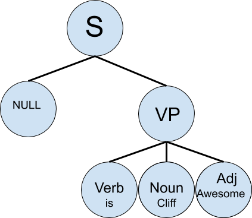
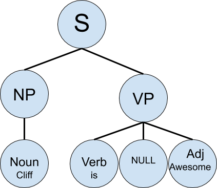

# Compilers

## What is a langauge?

After pulling out my HESP140 notes, I can say with some confidence that a formal
definition for language can be simply put as a system of communication. However,
after pulling out my philosophy notes, I want to say that language is anything 
that transfers what goes on 'in our mind' to 'out of our mind.' I'm sure more 
important people would disagree, but eh.  

But I digress. So far, you've been learning all these languages, some more 
useful than others, and learning a key important part of their paradigm. I mean,
if there was one good way to program, why are there so many languages? Why can 
we have all these programming languages? As you learned in 216, everything's 
just binary in the end anyway. This is because, we can take certain patterns, or 
segments of machine code and bind them to a different command. You learned in 
216, a return call is actually around 4-6 assembly instructions. Other keywords 
or paradigms like 'import' or string concatenation, or arrays and stacks are 
just analogous to large segments of machine code. This is because as we go from 
lower level to higher level, we can introduce some new concepts and do all these
cool things. Yet at the end of the day everything is just binary. Everything 
gets *compiled* down. How?  

### Lexing
Every programming language has a grammar. Every language has syntax. The order 
and meaning of each of these things determines the machine code to be generated.
For those who took 330 and learned how to parse and make lexers, this should 
sound familiar to you. For those who haven't I can break it down really quickly 
for you.

You are reading this probably on a computer of some sort. There are clusters of 
pixels on your screen right now and they make these squiggly lines. Grouping 
these squiggly lines together and turning them into something useful like words
is what lexing is. A lexer will take a string, and return a list of tokens. A 
token is basically just something useful for the computer to have. Each work 
could become a token, or a sequence of characters can be converted into a token.
lexing (as we will see with Flex) is just the process of looking at a string
and turning it into a sequence of useful tokens. In English, we do this with 
Turing pixel clusters or squiggly lines into characters or words. 

Consider the following pixel clusters: 'Cliff is Awesome'. You took those pixels
and turned certain pixel clusters into words. That is, you made 3 tokens, the 
'Cliff' token, the 'is' token, and the 'awesome' token. You now have a list of
tokens. This is what the lexer does. (There's a bit more we do to get those 
tokens, but I will discuss that later.) 

### Parsing 
After a lexer generates a list of tokens, and after you converted these pixels 
into words, you need to assign meaning to them. The token lists ['is', 'Cliff',
'awesome'] and ['Cliff', 'is', 'awesome.'] are both lists that the lexer could
generate. Yet these lists do not have meaning by themselves. We need to give 
them meaning. One step of this is a parser. A parser's job is usually to check 
syntax of the token list, analyze the token list and then create an internal or
intermediate representation of the input. So let's take the two lists and assign
an intermediate representation of the tokens. 

Suppose we know our parts of speech and can easily assign a token a part of 
speech. Let us also suppose our representation is a tree where a node stores the
part of speech and token. So 'Cliff' is labeled a Proper Noun, 'is' is labeled a 
verb, and 'awesome' is labeled an adjective. Then, we can refer to this very 
simplified grammar structure for the English language:

+ A Sentence consists of a Verb Phrase *sometimes* followed by a Noun Phrase
    + A Noun Phrase is a just a Noun 
    + A Verb Phrase is a Verb followed by a Adjective, *sometimes* with a Noun 
    between the Verb and Adjective.  

*This is not accurate for English and you can check out [this 
link](http://www.cs.uccs.edu/~jkalita/work/cs589/2010/12Grammars.pdf) for a more
complete, yet still simplified, version of the English Language*

Thus, we know the token list of ['is', 'Cliff', 'awesome'] is a Verb Phrase and 
the token list of ['Cliff', 'is', 'awesome'] is a Noun Phrase followed by a 
Verb Phrase. Thus, the trees can look like the following:


  

Then, these trees can be passed into either an interpreter or a compiler or 
both. We won't talk about compilers too much here (you can take CMSC430 for that
) but we will do a bit of interpreting on the project (similar to CMSC330's 
small c project, but not the same at all).

In this class we are going to use a Look Ahead Left to Right Parser (LALR). 
This just means we will be looking ahead with only one token, parsing left-to-right,
with the right-most-derivation.

### Interpreter

Once we have the immediate representation we can start looking at the structure
or any flags in the intermediate representation to help determine the meaning of
the sentence. The interpreter's job is to take this intermediate structure and 
produce an evaluation of the structure. For the first structure which could 
represent a question or inquiry, a proper evaluation would be 'yes' (or no). For
the second structure, a potential response could be NULL as we are assigning a 
value to a variable. In this class we will be building a calculator so when 
given a mathematical expression, you will be returning what the expression 
evaluates to. 

## Flex and Bison

Yeah, yeah, this is cool and all, but this course is called *A Tour of 
Programming Languages*, whats the language we'll be covering?

Okay to be honest, we aren't really doing a language, but more software. Flex is
a program that generates lexical analyzers. Basically a scanner or lexer. Bison 
is a program that generates parsers. That doesn't mean however, it's not 
important since lexers and parsers is why we have so many languages to begin 
with. Additionally, as you learn more paradigms, if you wished you are using a 
language that doesn't support a paradigm  you like, you can always add it to and
write your own compiler or interpreter. Also understanding compilers or at least
interpreters help explain why so many paradigms can exist.

For those that took CMSC330, you can probably just continue, but for those that
have not or want a refresher on CFGs, Regex, etc, you might want to read 
[background reading](#background-reading)

### Flex

Each flex file is split into 3 parts:
  + [Declarations](#declarations)
  + [Tokens](#tokens)
  + [Code Section](#code-section)

#### Declarations

Each section is separated with '%%'. The first section has any Flex options 
which may be needed and any C declarations which should be included. Flex 
options are preceded by '%option' while C declarations are encased by '%{' and 
'%}'. There are 4 options we will use in this class  
  + noyywrap
    + tells the compiler that the function yywrap has not been defined. This is
    fine for us because we do not need to use yywrap. yywrap is the function 
    that is called when the 'end of file' flag is set. %option noyywrap says to 
    just return when this occurs. 
  + nodefault
    + usually when you create tokens, you know all the possible input that will
    come into your program. However, if the lexer comes across something unknown
    the default action is to just ECHO. This option disables this feature. I 
    suggest throwing an error rather than just ECHOing. 
  + yylineno
    + tells Flex to keep track of the line number of the file when a pattern is
    matched. I find this alwayss useful to have, for functionality or debugging.
  + case-insenstive
    + Usually Flex (if not using regex) will match case sensitively. If you want
    to enable case insensitve matching use this option.

In addition to options, if you need header files or want to define any enums, 
structs, or other C variables, you can encase these definitions in between '%{' 
and '}%'. See the examples for details. 

If you want to define any regex definitions (like you want them in one place, or
one is used multiple times or just because) you can do so by having the 
identifier followed by the regex surrounded by '(' and ')'. See the examples for
details. 

Flex also keeps track of token type and this value is stored in the 'yylval'
variable. For simple Flex programs you probably don't need to worry about this 
value. However if you use Bison, you can store more meta data to be associated 
with the token. See examples for details and [Flex Variables and 
Functions](#flex-variables-and-functions) for more information. You can also see
Bison's [declarations](#declarations-1) for the '%union' structure.

Finally, if you want to include or differentiate between possible start states,
you can use the '%x' or '%s' commands to do so. '%x' will declare exclusive 
start state while '%s' will declare inclusive start states. In this course we 
will use '%x' if we need multiple start states, but you can see the 
[CFG](#context-free-grammars) section when talking about start states for more 
info.

#### Tokens

The Token section will probably be the most tedious section but one which is 
needed and pretty simple to write. The entire section is just a list of regex 
and code pairing. When a regex is matched, the associated C code will be run. 
The syntax is very similar to a switch/case statement in C or Java. The C code
is encased in '{}' braces. This is usually just a return statement or a function
call. See [regex](#regex) section for what regex is and how to make them. If you
want multiple patterns to map to the same C code, you can use the '|' to have it
be associated with the regex pattern that comes after it. See examples for 
details. 

#### Code Section

This is the section where you can write functions to be called or any other C 
code you need. Usually this section will be blank as you can just have a 
'#include' header file in the declaration section and compile the code with a C
file. However, you can just make entire programs using Flex. See examples for 
details. 

#### Flex Variables and Functions

Flex includes some built in functions and variables which you can refer to when
writing your C code. 

  + yyrestart(FILE)
    + resets the pointer to the beginning of the FILE being passed in.
  + yytext
    + the string matched via the regex
  + yylex()
    + call the lexer
  + yylval
    + Initially just an int value of the token. If Bison is used, this can be 
    modified with the '%union' struct.
  + yyterminate();
    + ends execution of the program
  + yy_create_buffer(FILE, int)
    + when scanning for input, it can use stdin or a File. For memory purposes 
    it is usually better to load a chunk of the file into memory at a time. This
    function will create a buffer for this.
  + yy_switc_to_buffer(int)
    + will switch to a buffer with the size given. Used in tandem with 
    yy_create_buffer(FILE, int)
  + yylineno (if defined via option)
    + will keep track of the line no when a regex is matched. 

Any scanner created by Flex is, by default, not reentrant. This can make flexing
on different threads difficult. This is because flex only keeps one variable of 
the last tokenized input, unlike other lexers. Like, weird Flex, but okay. It's 
fine. There is thankfully, a way around this. 

### Bison

Like Flex, Bison is split into the same 3 part structure:

  + [Declarations](#declarations-1)
  + [Rules](#rules)
  + [Code Section](#code-section-1)

#### Declarations

Looking very much like Flex's declaration section, this is where you should 
include any header files you want to be using, which are enclosed by the '%{' 
and '%}' symbols. If you need to include any other C declarations, you can put
them here, but again, you usually will put this in a separate c file.

This section is also where you should make a union struct if needed as briefly 
mentioned in the Flex section. Recall that Flex will keep track of the token 
type and this value is stored in the 'yylval' variable. In some (most) cases you
will probably want to store more than just the token type to be passed from the
lexer to the parser. Thus, you can use the '%union' construct to pass metadata 
if needed. 

Consider the following segment of code:  

```
/* union in the Bison Parser file */
%union {
  double d;
}
```

Suppose we were matching on the regex `[0-9]*"."[0-9]+`. The token which could
be returned would be something like NUMBER, but we would still want to know what
the number is. Since yylval initially just stores a simple integer value 
associated with the token, we can change yylval's type to a struct to hold other
values. Additionally we need to declare which tokens have what types of values
associated with them. Thus we would use something like the following:
```
%token <d> NUMBER
```
This tells bison that the NUMBER token has the value of <d>, which 'd' has type
double. 

If you take a look at the Makefile, you will notice that Bison is run before 
Flex. This means that anything you declare or define in Bison's declaration 
section can be used in Flex. When compiled, Bison will generate it's own header
file that will be compiled with whatever files Flex generates. Thus, it is the
Bison's declaration section where you will define which tokens ('%token') you 
will be using. Now, you do not need tokens for everything as you can use 
characters as tokens and the int value is just the ASCII value of the character.
Bison starts user defined tokens at 258 so there's no overlap. 

In addition to tokens having a type, you can assign types to parts of the CFG 
using the '%type' command. See examples for details. 

Finally, this section is where you can change associativity of certain rules. 
See [CFGs](#context-free-grammars) for background reading and [rules](#rules) 
for more information. 

#### Rules 

Much like how Flex had a list of tokens followed by code that should be run when
the regex was matched, Bison will have a list of rules from the CFG followed by 
C code which should be run when a rule is met. The syntax for this section is
similar to the Backus-Naur Form of writing CFGs. Here is a simple example of 
Bison code to handle addition and multiplication of numbers:
```
exp: factor           { /* code */ }
  |exp '+' factor     { /* code */ }
factor: NUMBER        { /* code */ }
  |factor '*' NUMBER  { /* code */ }
```

Notice that each different rule is separated by a '|' symbol. The other thing to
point out is that this example is not formatted like the CFGs found in the 
[CFG](#context-free-grammars) section, or any CFGs you may have seen in CMSC330 
because they look right associative. There is also the question of precedence. 
You can manually change the associativity of a rule and it's precedence by using 
the '%right', '%left', '%noassoc' commands in the Declarations section of the 
Bison file. The command name tells bison if the rule is left or right or 
non-associative, while the order which you give the commands tells the 
precedence. See the example for details. 

#### Code Section

This section acts the same as flex. If you need define functions that are called
in the rule section, you can define them here. I don't really suggest doing this
as you should really just have a separate c file which is compiled with the 
files generated by Flex and Bison, but for really small programs, it can be 
useful.

### Background Reading

#### Regex

Regex stands for  *regular expressions* and is a syntax to help create search 
patterns. This is what Flex will use when search for text to convert into a 
token. 

A regular expression can be considered as a set of rules to match patterns in 
sets of strings. The rules are quite simple, we have constants and basically 3 
operations.

+ Constants
	+ empty string
	+ literal character like 'a' , 'b', etc.
+ Operations
	+ Concatnation
	+ Union
	+ Repetition
		+ zero or more
		+ one or more
		+ zero or one
		+ exactly *n* times
		+ at least *n* times
		* between *x* and *y* times

Using these rules we can create patterns to match strings with
See these examples:
```Ruby
# in Ruby we place regex in '/'. We don't do this in Flex or Bison but I am 
# doing so here so you can easily see what the expression is.
/Hello/ # matches on "Hello" or any string that has "Hello" in it
/^Hello/ # matches on any string that starts with "Hello". The ^ symbol means start of string
/Hello$/ # matches on any string that ends with "Hello". The $ symbol means end of string

/^Good (night|morning)$/ # this will match on either the string "Good night" or
# "Good morning". The | symbol will match either side.

# now while we could do something like (a|b|c|...|x|y|z) we can use a character
# class instead. That is:
/^First Initial: [A-Za-z]$/ # this will match on any string that starts with 
# "First Initial: " and is then followed by any upper or lowercase letter between
# A-Z. We can also use numbers for a character class
/^Age: [0-9]$/ # this will match on any string that starts with "Age: " and is
# then followed by an  digit 0-9.

# Now while we could do something like [0-9][0-9] for double digit ages and then
# union them like ([0-9]|[0-9][0-9]) for both single or double digit ages, we
# can use a variety of the repetiion operators instead.
/^Age: [0-9]+$/ # this will say one or more occurances of a digit. The + operator
# means you must have at least one occurance of the pattern its attached to.
/^Age: [0-9]+$/ # this will say zero or more occurances of a digit. The + operator
# means you must have at least zeor occurance of the pattern its attached to. 
# Thus this one will match with an empty string.

We could also use other operators for the same affect
/^Age: [0-9][0-9]?$/ # this will match on single and double digit numbers. The ?
# means zero or one, which means there may or may not be a second digit
/^Age: [0-9]{1}$/ # single digit age only
/^Age: [0-9]{1,}$/ # at least one digit
/^Age: [0-9]{1,3}$/ # between 1 and 3 digits (inclusive)
# putting {} after an expression can say how many times you want something 
# repeated.
```
[Rubular](https://rubular.com/) is a useful tool and I use it, regardless of 
what language I am using.

#### Context Free Grammars

Context free grammars or CFGs are rules used to describe grammars of any 
language. The earlier example of "Cliff is awesome" using noun phrases, verb 
phrases and parts of speech is actually a crude version of a CFG. 

Let us consider Racket's project and syntax of prefix notation. We said that in
Racket, function calling acts like a list, (+ 1 2). That is, the grammar states
there must first be the function, followed by the parameters. Each parameter can
be another expression itself.

So we may represent the grammar like so:

```
Expr -> (Function Expr Expr) | Number
Function -> + | - | * | /
```

That is, an expression consists of a function followed by two expressions, or 
an expression is a number. So `12` is an expression, and so is `(+ 2 3)`. Also 
a function is defined as one of the four basic math operator symbols. So I can
represent any expression that consists of adding,subtracting, multiplying, or 
dividing 2 numbers via this grammar.

```
(+ 1 2) -> (Function Expr1 Expr2), Function = + Expr = 1, Expr2 = 2
(+ (- 3 2) 1) -> 
(Function Expr1 Expr2)
	Function = +, 
	Expr1 = (Function1 Expr3 Expr4),
		Function1 = -
		Expr3 = 3
		Expr4 = 2
	Expr2 = 1
```

I can of course nest expressions as far down as I need to.
